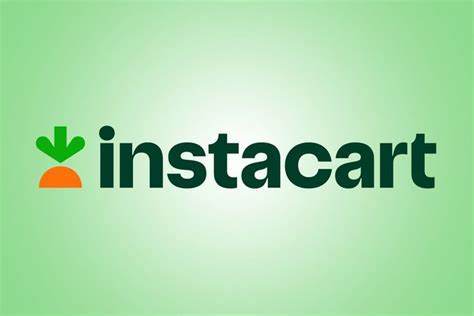

### Data Analyst

<!-- Navigation Links -->
<a href="#About Me" class="btn">About Me</a> |
<a href="#Projects" class="btn">Projects</a> |
<a href="#Contact Me" class="btn">Contact Me</a> 

---

Feel free to [email me](mailto:nancykolaski@gmail.com).

#### Data Analyst 

# Contact Me

&bull; nancykolaski@gmail.com  

&bull; <a href="https://github.com/Nancy-Kolaski/Nancy-Kolaski.github.io/blob/main/Kolaski-Nancy-resume.pdf" target="_blank">Resume</a> 

&bull; [LinkedIn](https://www.linkedin.com/in/nancy-kolaski-040b222b0/) 

&bull; [GitHub Repositories](https://github.com/Nancy-Kolaski) 

&bull; <a href="https://github.com/Nancy-Kolaski/Nancy-Kolaski.github.io/blob/main/NK Data Analytics Portfolio.pdf" target="_blank">View complete portfolio</a>

***

# About Me  

##### I am a data analyst with a background in healthcare, inpatient therapy.  My passion has always been in neurology since the brain uncovers the mysteries that define people & humanity.  I'm excited to branch into this new role with a focus of studying data to uncover mysteries in a different way, revealing truths of the world. 

##### My curious nature has led me towards this career change with an eagerness to engage in the world of data analytics.  I have completed my certification through CareerFoundry, and I'm excited to put my skills to work!  Scroll down to see my projects and skill set.

# Skills:

| 
Analytical Skills
                                 | 
Professional Skills
           | 
Tools
           |
|---------------------------------------------------------------------|------------------------------------------------|----------------------------------|
|   
 * Data Cleaning & Prepration 
                   |     
 * Problem Solving  
      |     
 * SQL
      |
|   
 * Exploratory & Descriptive Analysis  
          |     
 * Communication 
         |     
 * Python
   |
|   
 * Integrating & Transforming Data  
             |     
 * Collaboration  
        |     
 * Excel
    |
|   
 * Querying, Filtering, Sorting, Grouping
        |     
 * Presentatiion Skills
   |     
 * Tableau
  |
|   
 * Performing Statistical Analysis 
              |     
 * Organization 
          |          
|   
 * Writing technical documentation & Reports
     |     
 * Spanish Proficiency
    |
|   
 * Data Visualizaitons & Dashboards 
             |                       
|   
 * Machine Learning   
                           |                       

***

# Projects: 

***

### Instacart Basket Analysis

[Check out my Instacart project in more detail](project1.md#project1) 

Instacart is a well known and widely used online grocery shopping service looking to uncover more information on their sales patterns.  This project was utilized through CareerFoundry with the purpose of introducing python to students, enabling opportunities to dissect a mock data set for the company.  

*** 

### Influenza Analysis

[Check out my Influenza project in more detail](project2.md#project2)

The purpose of this analysis was to prepare medical staffing agencies with appropriate staffing in anticipation for flu season across the United States.  This was a CareerFoundry project using real data.

***

###  Rockbuster Stealth Analysis

[Check out my Rockbuster project in more detail](project3.md#project3)

Rockbuster Stealth is a mock movie rental company that used to have stores around the world, looking to move to an online rental service in effort to stay competitive along side new streaming agencies.  This was a CareerFoundry project utilized to introduce SQL to analytics students.

***

###  U.S.A. Real Estate Analysis

[Check out my U.S.A. Real Estate project in more detail](project4.md#project5) />
</a>

Investigation of real estate across different regions of the United States, dissecting different variables to see their imact on the market.  This was a project that CareerFoundry allowed analytics students to choose a topic of their choice.  I chose real estate to explore for this open-ended task.

*** 

### Machine Learning - ClimateWins Weather Predictions & Climate Change

[Check out my Machine Learning project in more detail](project5.md#project5)

This project used real weather data from Europe to guide a fictional company, ClimateWins, in using machine learning to predict the consequences of climate change around Europe and, potentially, the world.  This analysis investigated and justified the potential for using machine learning in weather predictions.  This project was performed during the Machine Learning Specialization portion of my coursework, introducing concepts for both supervised and unsupervised algorithms.

***

### GameCo Financial Analysis

[Check out my GameCo project in more detail](project6.md#projec6)

Assist GameCo Video Game company (a mock company) in developing new games and establish better marketing strategies across North America, Europe, and Japan using historical data since the 1980s.

***

# CONTACT ME: 

&bull; nancykolaski@gmail.com

&bull; <a href="https://github.com/Nancy-Kolaski/Nancy-Kolaski.github.io/blob/main/Kolaski-Nancy-resume.pdf" target="_blank">Resume</a> 

&bull; [LinkedIn](https://www.linkedin.com/in/nancy-kolaski-040b222b0/) 

&bull; [GitHub Repositories](https://github.com/Nancy-Kolaski) 

&bull; <a href="https://github.com/Nancy-Kolaski/Nancy-Kolaski.github.io/blob/main/NK Data Analytics Portfolio.pdf" target="_blank">View complete portfolio</a>

***

<a href="#top">Back to Top</a>

