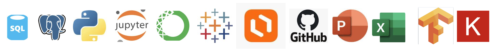

#### Data Analyst 
nancykolaski@gmail.com 

[Resume](https://github.com/Nancy-Kolaski/Nancy-Kolaski.github.io/raw/main/kolaski-Nancy-resume.pdf) -
[LinkedIn profile](https://www.linkedin.com/in/nancy-kolaski-040b222b0/) - 
[GitHub Repositories](https://github.com/Nancy-Kolaski) - 
[View complete portfolio](https://github.com/Nancy-Kolaski/Nancy-Kolaski.github.io/raw/main/NK%20Data%20Analytics%20Portfolio%20(6).pdf)

# About Me  

##### I am a data analyst with a background in healthcare, inpatient therapy. My passion has always been in neurology since the brain uncovers the mysteries that define people/humanity. I'm excited to branch into this new role with a focus of studying data to uncover mysteries in a different way, revealing truths of the world. 

##### My curious nature has led me towards this career change with an eagerness to engage in the world of data analytics.  I have completed my certification through CareerFoundry, and I'm excited to put my skills to work!.  Scroll down to see my projects and skill set.

### Skills

| 
Analytical Skills
                                 | 
Professional Skills
           | 
Tools
           |
|---------------------------------------------------------------------|------------------------------------------------|----------------------------------|
|   
 * Data Cleaning & Prepration 
                   |     
 * Problem Solving  
      |     
 * SQL
      |
|   
 * Exploratory & Descriptive Analysis  
          |     
 * Communication 
         |     
 * Python
   |
|   
 * Integrating & Transforming Data  
             |     
 * Collaboration  
        |     
 * Excel
    |
|   
 * Querying, Filtering, Sorting, Grouping
        |     
 * Presentatiion Skills
   |     
 * Tableau
  |
|   
 * Performing Statistical Analysis 
              |     
 * Organization 
          |          
|   
 * Writing technical documentation & Reports
     |     
 * Spanish Proficiency
    |
|   
 * Data Visualizaitons & Dashboards 
             |                       
|   
 * Machine Learning   
                           |                       

   

***

# Projects: 

***

### **Instacart Basket Analysis**

[Check out my Instacart project in more detail](project1.md#project1)

Instacart is a well known and widely used online grocery shopping service looking to uncover more information on their sales patterns. 

*** 

### **Influenza Analysis**

[Check out my Influenza project in more detail](project2.md#project2)

Preparing medical staffing agencies with appropriate staffing in anticipation for flu season across the United States.

***

###  **Rockbuster Stealth Analysis**

[Check out my Rockbuster project in more detail](project3.md#project3)

Rockbuster Stealth is a movie rental company that used to have stores around the world, looking to move to an online rental service in effort to stay competitive along side new streaming agencies.  

***

###  **U.S.A. Real Estate Analysis**

[Check out my U.S.A. Real Estate project in more detail](project4.md#project4)

Investigation of real estate across different regions of the United States, dissecting different variables to see their imact on the market.

*** 
### **Machine Learning**

[Check out my Machine Learning project in more detail](project5.md#project5)

Using machine learning to help predict the consequences of climat change aroudn Europe and, potentially, the world.  This analysis investigates the potential of using historical weather data to make weather predictions.

*** 
### **GameCo Financial Analysis**

[Check out my GameCo project in more detail](project6.md#projec6)

Assist GameCo Video Game company in eveloping new games and establish better marketing strategies across North America, Europe, and Japan.

