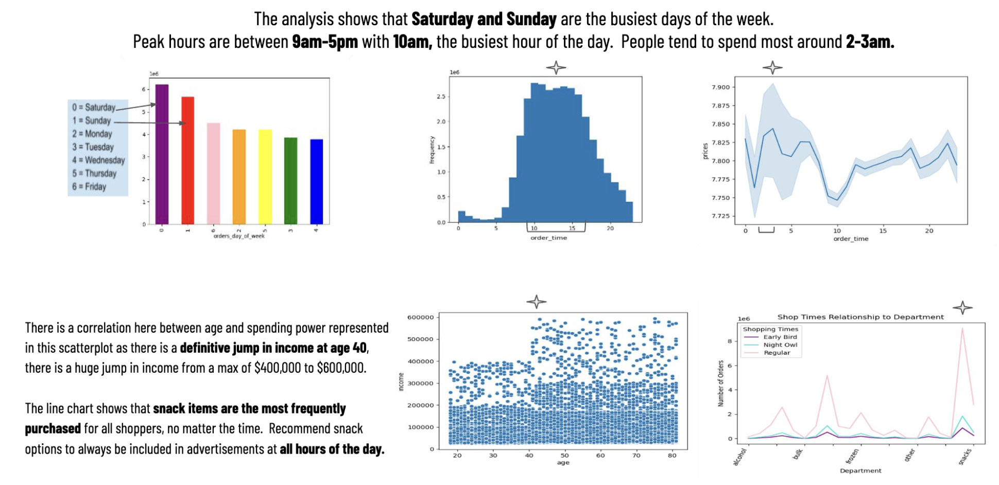
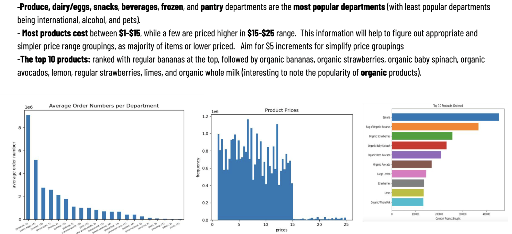
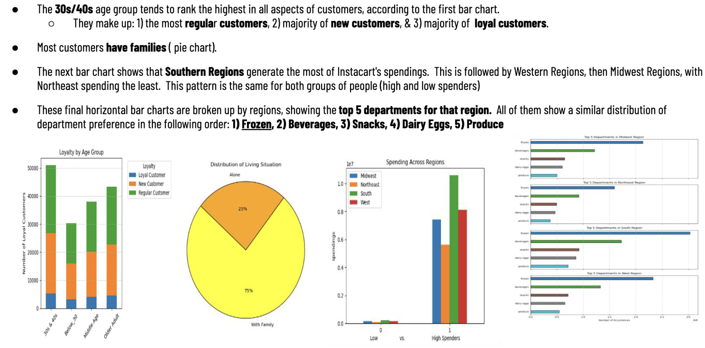
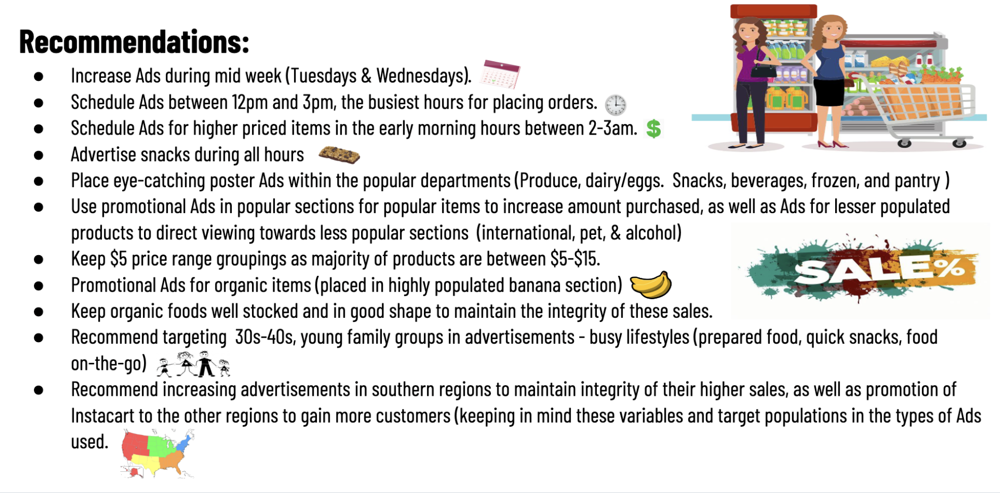
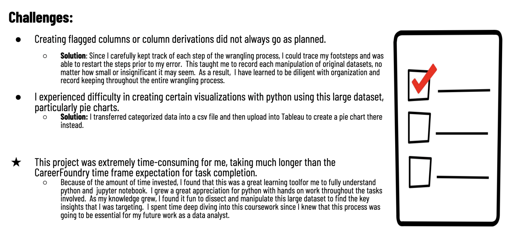

# Instacart Basket Analysis

This analysis for Instacart was performed in order to better understand customer behavior and sales patterns to adapt marketing strategies for further sales growth.

## Key Questions
- What are the busiest days of the week and hours of the day? 
- What are the particular times of day when people spend the most money?
- How can product price tags by simplified into price range groupings to help Marketing and Sales efforts?
- Are there certain types of products that are more popular than others? Which departments have hae the highest frequency of product orders?

#### **Skills:**
- Python/Anaconda
- Data Cleaning and data wrangling
- Deriving variables, merging
- Grouping datasets
- Aggregating data
- Population flows
- Visualizations in Python matplotlib, Seaborn, Scipy (line chart, bar chart, histogram, pie chart, scatterplot, stacked bar chart)
- Interpret Results and Summarize findings/insights.
- Reporting in Excel
  
## **Insights:**

#

#

#

