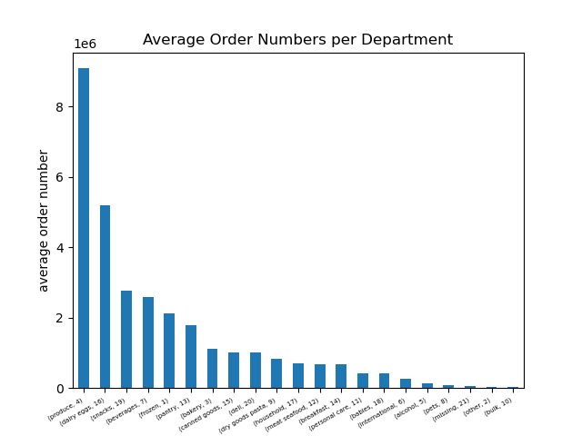

  <a href="/">Back to Main Page</a>   |  [Continue to next project](project2.md#project2)

***

# Instacart Baket Analysis

 [GitHub Repository](https://github.com/Nancy-Kolaski/Python-Instacart-Analysis/blob/main/Instacart%20Basket%20Analysis/Instacart_Presentation.pdf)

This analysis was performed as a mock investigation for Instacart stakeholders to better understand customer behavior and sales patterns to adapt marketing strategies for further sales growth by answering the key questions below.  

This was an CareerFoundry assignment with the project breif outline included <a href="https://github.com/Nancy-Kolaski/Nancy-Kolaski.github.io/blob/main/assets/Project%20Briefs/A4_Data_Immersion_Project_Brief.pdf" target="_blank">here</a>.

## Key Questions:
- What are the busiest days of the week and hours of the day? 
- What are the particular times of day when people spend the most money?
- How can product price tags by simplified into price range groupings to help Marketing and Sales efforts?
- Are there certain types of products that are more popular than others? Which departments have hae the highest frequency of product orders?

## Data link :

There were four data sets in this analysis, containing information on products, customers , orders, and departments.  They can be found at
[https://www.instacart.com/datasets/grocery-shopping-2017](https://www.instacart.com/datasets/grocery-shopping-2017 ) via kaggle.com

## Skills:
- Python/Anaconda
- Data Cleaning and data wrangling
- Deriving variables, merging
- Grouping datasets
- Aggregating data
- Population flows
- Visualizations in Python matplotlib, Seaborn, Scipy (line chart, bar chart, histogram, pie chart, scatterplot, stacked bar chart)
- Interpret Results and Summarize findings/insights.
- Reporting in Excel

         

------------------------
  
## **Insights:**

* **Saturday** and **Sunday** are the busiest days of the week.

* Peek hours are between **9am-5pm** with **10am**, the busiest hour of the day. 

* People tend to spend the most money around **2-3am**.

------------------------

* There is a correlation between **age** and **spending power**, with a definitive **jump in income at age 40**, from **$400,000 to $600,000**.

* The line chart shows that **snack items** are the most frequently purchased for all shoppers, no matter the time.

* Recommend **snack** options to be included in advertisements at **all hours of the day**.

 
------------------------
 
* **Produce, dairy/eggs, snacks, beverages, frozen,** and **pantry** departments are the most popular departments (with least ppular departments of *international, alcohol,* and *pets*.

* Most products cost between **#1-$15**, while a few are priced higher in **$15-$25** range.  This information will help to figure out apropriate and simpler price range groupsing, as majority of items are lower priced.  Aim for $5 increments for simpler price groupings.

* The **top 10 products** ordered: ranked with **regular bananas** at the top, followed by organic bananas, organic strawberries, organic baby spinach, organic avocados, lemon,regular strawberries, limes, and organic while milk (interesting to note the popularity of **organic products**)

* The **top 10 products** ordered: ranked with **regular bananas** at the top, followed by organic bananas, organic strawberries, organic baby spinach, organic avocados, lemon,regular strawberries, limes, and organic while milk (interesting to note the popularity of **organic products**)

------------------------

* The **30s/40s** age group tends to rank the highest in all aspects of customers, according to the first bar chart.
They make up: 1) the most **regular** customers, 2) majority of **new** customers, & 3) majority of **loyal** customers.  
*Most customers have **families** ( pie chart).
* The next bar chart shows that **Southern Regions** generate the most of Instacart's spendings.  This is followed by Western Regions, then Midwest Regions, with Northeast spending the least.  This pattern is the same for both groups of people (high and low spenders)

 

* These horizontal bar charts below are broken up by regions, showing the **top 5 departments for that region**.  All of them show a similar distribution of department preference in the following order: **1) Frozen, 2) Beverages, 3) Snacks, 4) Dairy Eggs, 5) Produce**

------------------------

# Recommendations Review:
* Increase Ads during mid week (Tuesdays & Wednesdays)
* Schedule Ads between 12pm and 3pm, the busiest hours for placing orders.
* Schedule Ads for higher priced items in the early morning hours between 2-3am.
* Advertise snacks all hours
* Place eye-catching poster Ads within the popular departments (Produce, dairy/eggs. Snacks, beverages, frozen, and pantry )
* Usw promotional Ads for popular items to increase amount purchased, as well as Ads for lesser populated areas (international, pet, & alcohol)
* Keep $5 price range groupings as majority of products are between $5-$15.
* Promotional Ads for organic items (placed in highly populated banana section)
* Keep organic foods well stocked and in good shape to maintain the integrity of these sales.
* Recommend targeting 30s-40s, young family groups in advertisements - busy lifestyles (prepared food, quick snacks, food on-the-go)
* Recommend increasing advertisements in southern regions to maintain integrity of their higher sales, as well as promotion of Instacart to the other regions to gain more customers (keeping in mind these variables and target populations in the types of Ads used.

------------------------

# Challenges:
* Creating flagged columns or column derivations did not always go as planned.
  * **Solution: Since I carefully kept track of each step of the wrangling process, I could trace my footsteps and was able to restart the steps prior to my error. This taught me to record each manipulation of original datasets, no matter how small or insignificant it may seem. As a result, I have learned to be diligent with organization and record keeping throughout the entire wrangling process.**

* I experienced difficulty in creating certain visualizations with python using this large dataset, particularly pie charts.
  * **Solution: I transferred categorized data into a csv file and then upload into Tableau to create a pie chart there instead.**
 
* This project was extremely time-consuming for me, taking much longer than the CareerFoundry time frame expectation for task completion.
  
  * **Because of the amount of time invested, I found that this was a great learning toolfor me to fully understand python and jupyter notebook. I grew a great appreciation for python with hands on work throughout the tasks involved. As my knowledge grew, I found it fun to dissect and manipulate this large dataset to find the key insights that I was targeting. I spent time deep diving into this coursework since I knew that this process was going to be essential for my future work as a data analyst.**

***
 
<a href="#top">Back to Top</a> | <a href="/">Back to Main Page</a>  |  [Continue to next project](project2.md#project2)

