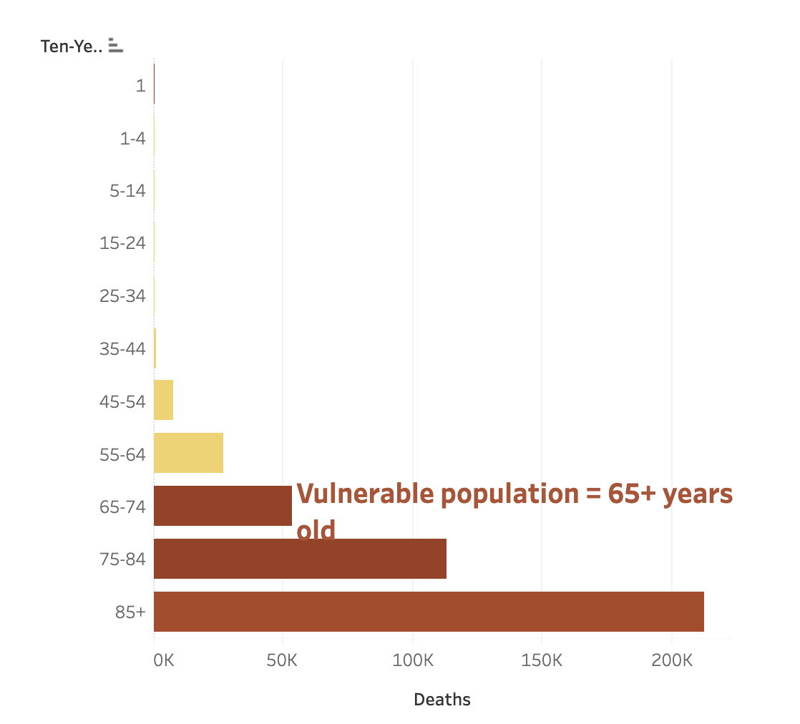
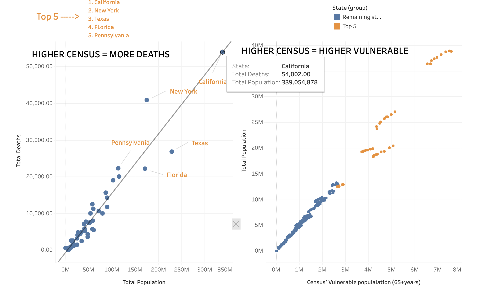
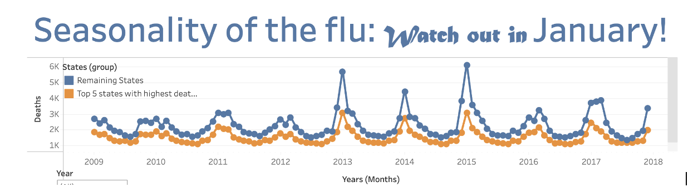

 <a href="/">Back to Main Page</a> | [Continue to next project](project3.md#project3)
 
***

# Influenza Analysis

 [Tableau Link for this project](https://public.tableau.com/app/profile/nancy.kolaski/viz/PreparingforInfluenzaSeason_17109791937900/Story1) 

The United States has an influenza season where more people than usual suffer from the flu. Some people, particularly those in vulnerable populations, develop serious complications and end up in
the hospital. Hospitals and clinics need additional staff to adequately treat these extra patients. The medical staffing agency provides this temporary staff. The purpose of this analysis was to determine when to send staff, and how many, to each states. The agency covers all hospitals in each of the 50 states of the United States, and the project will plan for the upcoming influenza season.

This was an CareerFoundry assignment with the project breif outline included <a href="https://github.com/Nancy-Kolaski/Nancy-Kolaski.github.io/blob/main/assets/Project%20Briefs/A1-A2-data-immersion-project-brief copy.pdf" target="_blank">here</a>.

## Goal: 
To help medical staffing agency that provides temporary workers to clinics and hospitals on an as-needed basis. The analysis will help plan for influenza season, a time when additional staff are in high demand. The final results will examine trends in influenza and how they can be used to proactively plan for staffing needs across the country.

## Hypothesis: 
If a person is 65+ years old, then they are more likely to die by flu.

## Data link 
This analysis utilized public databases from CDC & US Census Bureau consisting of influenza deaths by geography, population data , counts of influenza laboratory test results by state (in survery form), and surveys of flue shot rates in children.  The links are provided below.

[Influenza Deaths](https://wonder.cdc.gov/ucd-icd10.html) |
[Vaccine Data](https://www.cdc.gov/vaccines/imz-managers/nis/about.html) |
[Lab Results Data](https://gis.cdc.gov/grasp/fluview/fluportaldashboard.html)  |
[Survey of Flu Shot Rates](https://www.cdc.gov/nis/about/?CDC_AAref_Val=https://www.cdc.gov/vaccines/imz-managers/nis/about.html)

## **Skills:**
- Data Cleaning
- Statistical hypothesis
- Hypothesis testing (t-testing)
- Grouping datasets
- Temporal & Statistical Visualization in Tableau
  - Bar Chart, Scatter Plot, Choropleth Map, Line Graph
- Interpreting Results & Summarize findings/insights
- Presenting Results

## **Tools:**
- Excel
- Power Point
- Tableau

---

## **Insights:**

**1. The first step was to determine WHO (which population) was most affected by flu related deaths.**

By grouping the data into 10-year age ranges, it was easier to see that the vulnerable population makes up more flu-related deaths (or age groups that are 65 years of age and older).

**My Hypothesis was true**: If a person is 65+ years old, then they are more likely to die by flu.

**2. The second step was to find out WHERE these deaths are taking place.**

The first scatterplot shows the top 5 states with highest census listed in orange: CA, NY, TX FL, PA.
  
The second scatterplot looks only within the vulnerable (65+ years) populations.  There is a correlation to these higher census states contributng to all flu related deaths.  When referring to the scatterplots, the top 5 states from the left were all marked with orange dots on the right scatterplot to see this correlation clearly.

 - *A higher census brings a larger vulnerable population & more deaths.*

* This choropleth map below that shows many layers:
   - the vulnerable population (depicted by shades of green)
   - The death rates within that vulnerable population (depicted by shades of orange/red)
   - The total death numbers (depicted by size of the bubbles)

**3. The third step was to find out WHEN these deaths are taking place**

This line chart shows a trend of winter months within 2009-2017, specifically january, but higher flu deaths notable in December through March. 

This bar chart below shows a glimpse into the last three years (2015-2017); with January, February, & March ranking top months for flu related deaths.

***

## **Conclusion**

### **Insights:**
- Vulnerable populations (65+) make up most influenza deaths
  - 5 states with highest vulnerable population count: California, New York, Texas, Florida, Pennsylvania
- States with higher census bring higher death counts
- More deaths by flu occur in the winter months (December - March). January consistently has highest death counts.
  
### **Recommendations:**
- Top 5 High Risk States to prioritize staffing needs:
  - California
  - New York
  - Texas
  - Florida
  - Pennsylvania
- Seasonality:
  - Concentrated staffing needed during January mostly, along with winter months (Dec-March)
- Further analysis needed on:
  - Vaccination rates and their impact on death rates on the vulnerable and non-vulnerable populations (65+ vs below 65 years old)
  - Inclusion of other contributors to our vulnerable population, including those who are under 5 years old, are pregnant, or who have other comorbidities.

- Based on the analysis of this data, recommendations include supplying the top 5 states with influenza related deaths and population counts with increased staffing of hospitals and agencies during the months of January as priority, along with the winter months of December through March.

***

<a href="#top">Back to Top</a>

<a href="/">Back to Main Page</a> 

