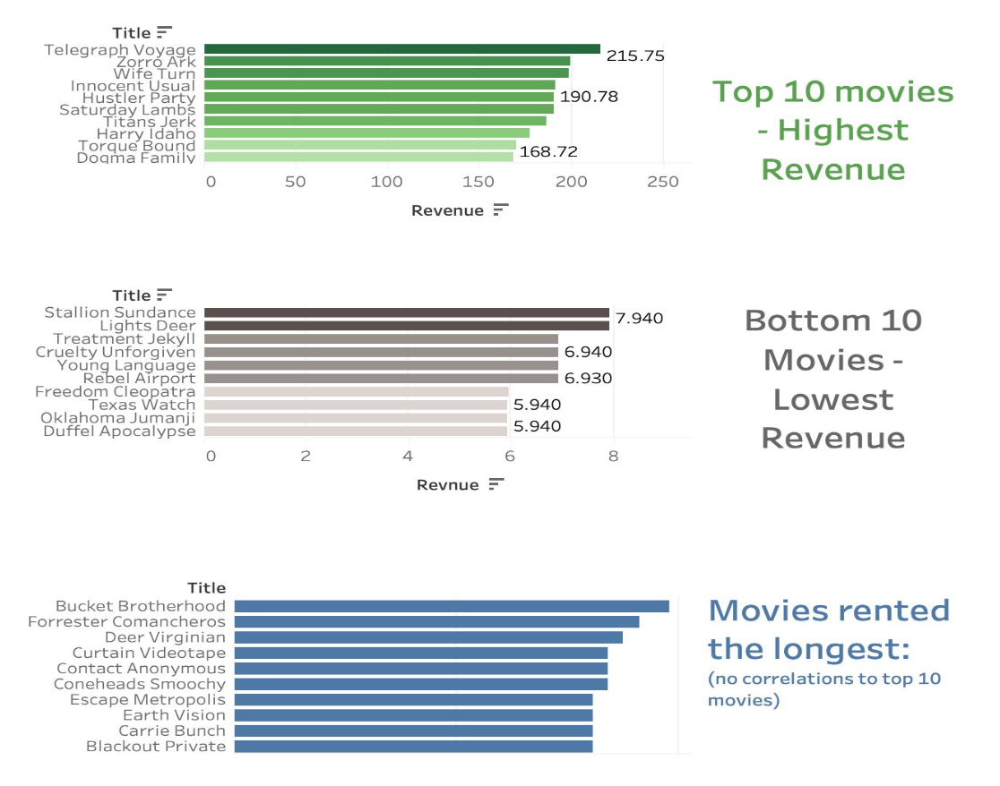

# **Rockbuster Stealth, LLC Analysis**

 [Tableau Link for this project](https://public.tableau.com/app/profile/nancy.kolaski/viz/3_10RockbusterPresentation_17134027032480/Story-noheading)

 [Github Repository](https://github.com/Nancy-Kolaski/SQL-RockbusterVideoRental)

## **Introduction:**
Rockbuster Stealth LLC is a movie rental company that used to have stores around the world. Facing stiff competition from streaming services such as Netflix and Amazon Prime, the Rockbuster Stealth management team is planning to use its existing movie licenses to launch an online video rental services in order to stay competitive.

## **Goal:**
Assist the Rockbuster Stealth business intelligence department, via SQL queries, in preparation for their 2020 market strategies, providing data-driven insights for a redefined approach for sales improvement.

## Key Questions & Objective
The Rockbuster Stealth Management Board has asked a series of business questions and they expect data-driven answers that they can use for their 2020 company strategy. Here are the main questions they’d like to answer:

● Which movies contributed the most/least to revenue gain?

● What was the average rental duration for all videos?

● Which countries are Rockbuster customers based in?

● Where are customers with a high lifetime value based?

● Do sales figures vary between geographic regions?

## **Steps and Skills:**
- SQL/Postgres
- Relational Database (Lucidchart)
- Database querying, cleaning, filtering
- Data Descriptions
- Joining, Subqueries, CTEs (Common Table Expressions)
- Visualizations in Tableau (line chart, bar chart, stacked bar chart, choropleth map, bubble chart)
-  Interpret Results and Summarize findings/insights.

## **Data Link**

[https://www.vgchartz.com/](https://www.vgchartz.com/)

The dataset includes information on Rockbuster’s data looaded into a PostgreSQL database including: film inventory, customers, payments, stores, staff, films, actors, rental history, addresses, and transactions. It is structured to reflect real-world business scenarios and relationships between different data tables.

## **Insights**

- **Let's look at rental duration**
  - Average rental duration is about 5 days long (maximum of 7 days and a minimum of 3 days).

- **Let's look into the films' revenue gains:**
    - These bar charts show the movies ranked for the top 10, bottom 10, & longest rentals in Rockbuster's database.
  

- **Let's look at the countries with the most customers**
    - The bar chat below shows the countries with the most Rockbuster customers.
 

- **Let's look at the cities with the most customers**
  - The map below narrows down for viewing of the top cities geographically within the top countires with the most Rockbuster customers.

- **Let's look at the countries with the most revenue**
  - 1 - India
  - 2 - China
  - 3 - United States

  

- **Let's look specifically at the top Rockbuster customers**
    - These customers' spendings were similar, falling between $189 and $212.

## **Conclusion**
  

### Top Insights:
- The top 5 countries bringing the most revenue are
  - India $6,000
  - China $5,200
  - U.S.A #3,600
  - Japan #3,100
  - Brazil & Mexico $2,900
- Geographical distribution is spread worldwide (no trends or centralized locations, interesting insight since most movies are in
english)
Top sales per top 5 customers averages to $200 each
Average rental duration is around 5 days for all videos
  - No correlation between longer movie rentals and top movies
  
### Recommendations:
- Interview top customers using questionnaires to find out what they like/don’t like about Rockbuster’s rental service
  - Since they are invested, they will likely know the process well and provide helpful feedback
- Use AI to formulate algorithms for movies that are similar to the top 10 movie list in order to advertise more movies similar (and vice versa for bottom list)
  - Collect revenue lists 3 months following to monitor for any increases
- Focus marketing for Rockbuster in the higher populated regions since they produce more revenue
- Introduce more movies with language dialects native to these top countries: India, China, Japan, Brazil, & Mexico

