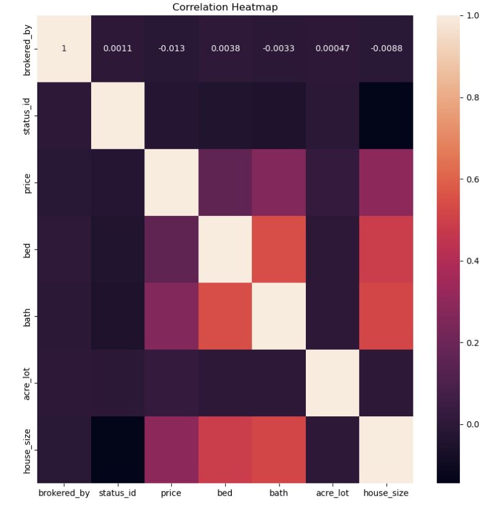
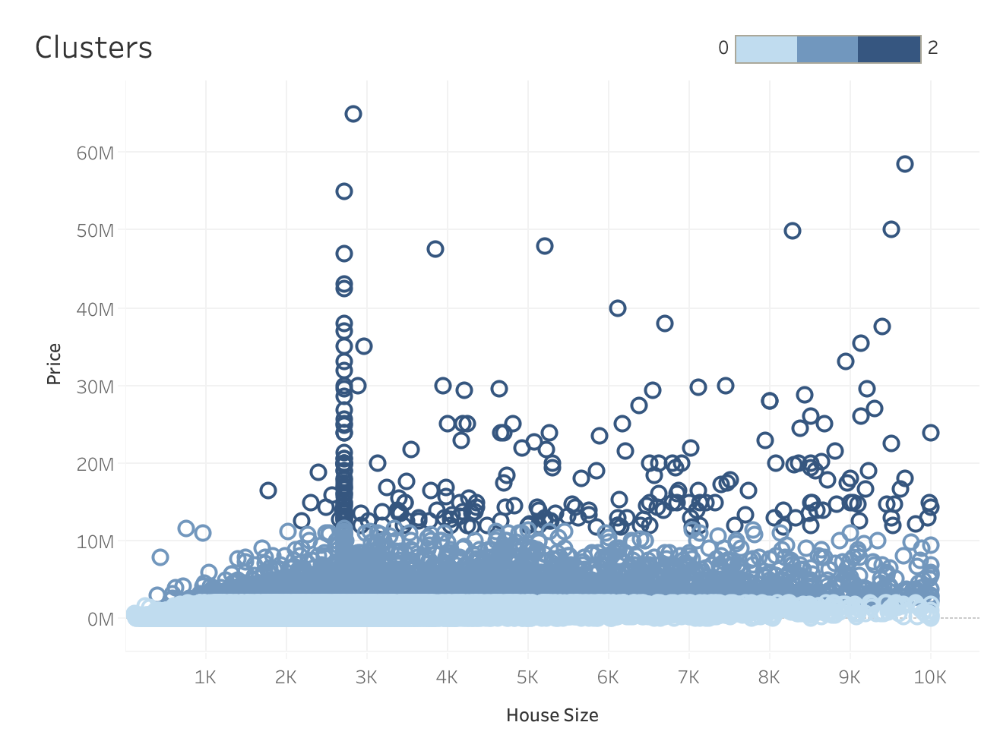
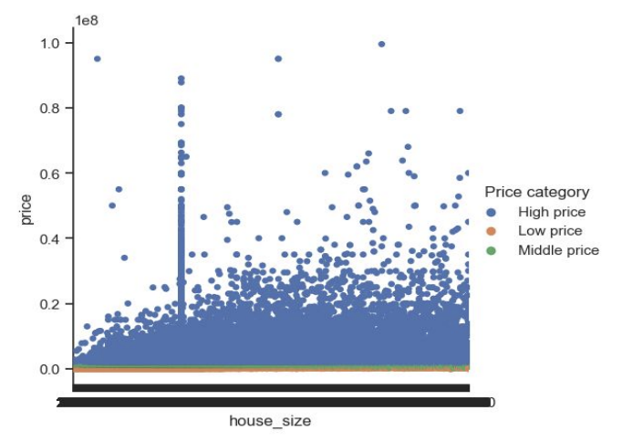
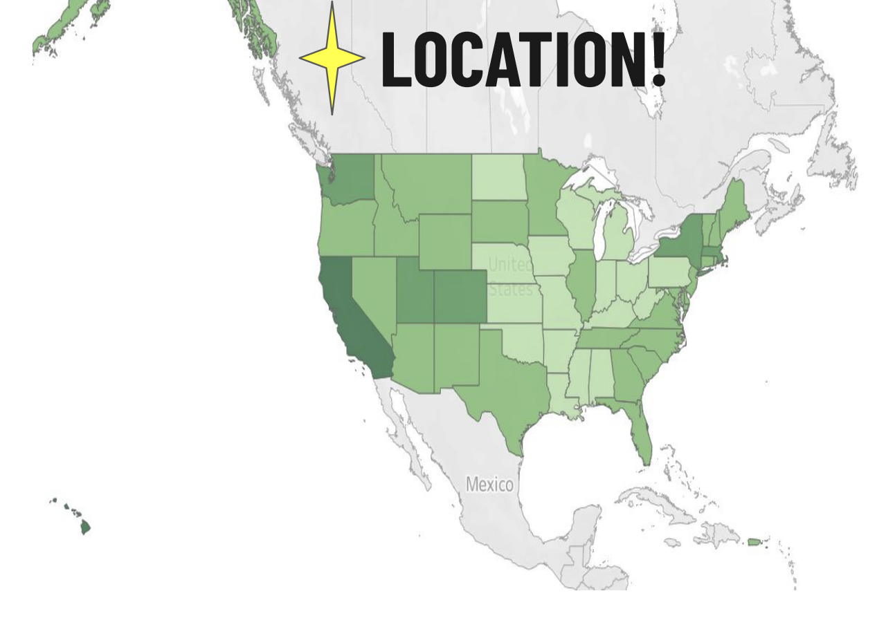
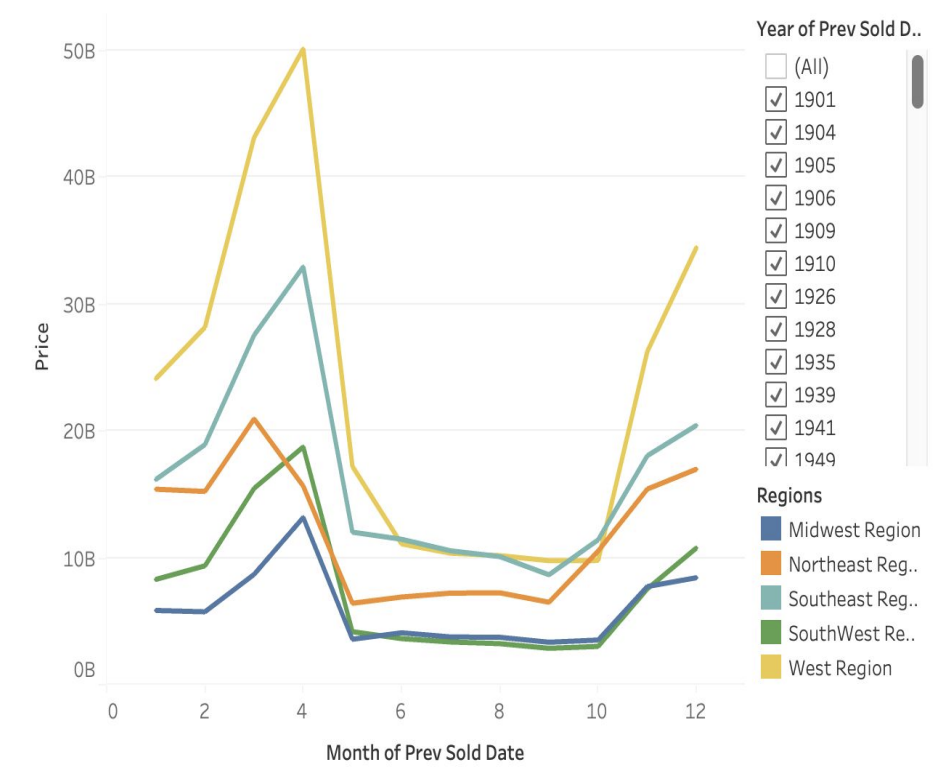
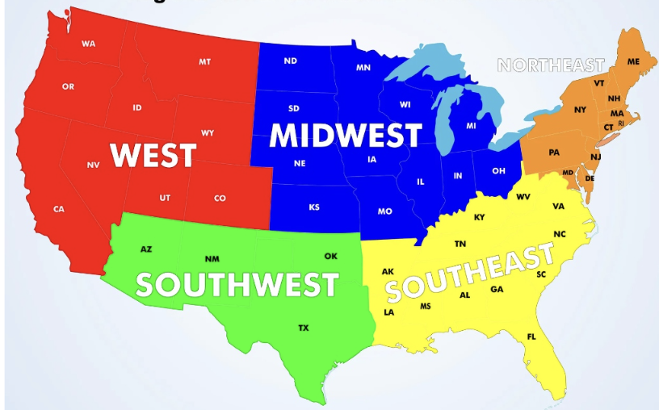

 <a href="/">Home</a> | [Next Project](project5.md#project5)

***

# U.S.A Real Estate Analysis
 

 

## Introduction:
This is an analysis of real estate data for the U.S.A., looking at trends and correlations, via python, to determine factors that most influence the real estate market.  Location, seasonality, and house size had the biggest influence on this data set.  

This was an CareerFoundry assignment with the project breif outline included <a href="https://github.com/Nancy-Kolaski/Nancy-Kolaski.github.io/blob/main/assets/Project%20Briefs/Data_Immersion_A6_Project_Brief copy.pdf" target="_blank">here</a>.

## Goal:
Analyze the United States real estate market to see what factors or variables influence sales the most.

## Key Questions:
- What geographic areas generate the most real estate revenue?
- What states sell the lowest priced homes?
- Does size affect the market? Does bigger acre_lot or house_size impact selling?
- Do number of baths (i.e: 2+ baths) sell more than homes with only 1 bath? Do number of bedrooms influence houses sold?
- When have most houses been sold/bought? Is there a seasonal trend?
- Have the market trends changed over time? 

## Hypothesis:
As house size increases, price increases.

## Steps and Skills:
- Data Cleaning
- Exploratory Analysis
- Linear Regression
- Scatterplots
- Clusterplot Analysis
- Pairplots

## Tools:
The following python libraries were used for this project
- pandas (for data analysis)
- seaborn & Matplotlib (for visualizations)
- numpy and scipy (for mathematical equations)
- Quandl (for time-series data)
- Tableau (for further visualization and story presentation)
- Excel (for creating crosstab data, specifically for using random sample to import clustered data into tableau for visualization)

## Data:

[https://www.kaggle.com/datasets/ahmedshahriarsakib/usa-real-estate-dataset](https://www.kaggle.com/datasets/ahmedshahriarsakib/usa-real-estate-dataset) 

The dataset was one large csv file with information including
  - location factors: address, zip, city, state
  - previous sold dates
  - house size
  - acre lot size
  - number of bed and bathrooms
  - who the homes were brokered by
  - status of home (for sale vs. not)
  - price of home

***

## Insights:

By using this correlation heatmap (below), I was able to determine the strongest positive correlations. Since bed, bath, and house size all seem to be obvious in their correlation, it was determined to further explore the relationship between house size and price
(noted by the lighter purple color).

 

- To test this hypothesis (*As the house size increases, so does the price*), I conducted a linear regression (noted below).
  - There are many points that fall outside of the regression line. This was not enough to draw a significant conclusion.
  - I tried another approach -> Clusters
  - In order to prove the hypothesis besides only using linear regression, I conducted a cluster analysis. This categorical plot
groups data into 'clusters' in order to compare each group to uncover patterns.
     - Cluster 0 represents low priced homes.
     - Cluster 1 represents medium to high priced homes.
     - Cluster 2 represents very high priced homes.
   
- This plot shows that cluster 1 (med-to-high priced homes) have outliers for very high priced homes while the other two
clusters stay within a certain range.
- All three clusters share a large amount of homes at around 2700 square feet, meaning this is a common house size across all price ranges.

 

- I utilized Tableau to produce the above scatterplot, as it was easier to manage and interact with.  The below scatterplot is the same information using matplotlib from Python:

- Geography plays an important role on the price. Western and Northeast Regions, indicated by the darkest green color, demonstrate the highest revenue generated from real estate within the U.S.A. These top states include **Hawaii, California, Montana, Colorado, Utah, New York, & Massachesetts**. Lighter green states (midwest) show the least revenue generating states.

- Let's look at seasonality (1901-2023).  Sales remain the same across all regions.
  - Most homes are sold in March and April, regardless of location and year.
  - Revenue is represented highest in total for West Regions, then Southeast, Northeast, Southwest, and Midwest marked as producing the lowest revenue. This is parallel to cost of living parameters. Trends remain the same.
  - April is the hot month for selling/buying.
  - *Note: 2024 was left out as homes without a previous sold date were marked for today's date (raising the month to current month of august 2024). By removing this year, we have eliminated the risk of tainting data to show more sales where they have not occurred.*

## Conclusion: 

### Insights:
- PRICES and LOCATION:   
  - Highest real estate prices exist within the west and northeast regions: CA, HI, MT, CO, VT, NY, MA
  - Lowest real estate prices are in the midwest
- PRICES and HOUSE SIZE:   
  - Strongest correlations exist between house size and price
  - The bigger the house size, the higher the price is, generally.
  -  2700 square feet tends to be a house size that is standard across ALL PRICES!
- SEASONALITY:   
  - Most homes are sold in April (and March).

### Recommendations:
- There was a large amount of data where previous sold dates were blank. It was assumed that these were newer builds without a previously sold date. These
homes were left out of the seasonality. Next steps would be to clarify this.
- Acre lot sizes and house sizes had a HUGE variance in size, along with price range. It would have been insightful to have more details with these homes/listings
to understand the context of these ranges. Especially acre lots and house sizes marked as '0'. This does not make sense as it is impossible to have a house or
lot size equal to 0. Next steps would be to clarify the number markers, determine if these were missing values filled in, and eliminate or impute values.

***

<a href="#top">Back to Top</a> | <a href="/">Home</a> | [Next Project](project5.md#project5)

