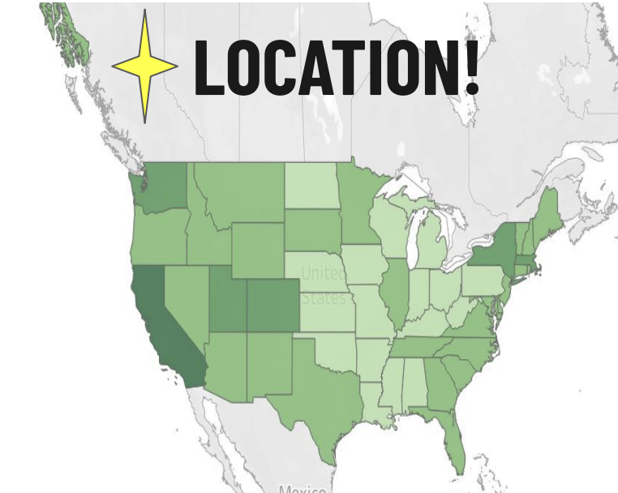

# U.S.A Real Estate Analysis
 

  [Github Repository](https://github.com/Nancy-Kolaski/Python-USA_Real_Estate-Analysis)

 [Tabeleau Dashboard](https://public.tableau.com/shared/4H7DHWB3H?:display_count=n&:origin=viz_share_link)

## Introduction:
This is an analysis of real estate data for the U.S.A., looking at trends and correlations, via python, to determine factors that most influence the real estate market.  Location, seasonality, and house size had the biggest influence on this data set.  

## Goal:
Analyze the United States real estate market to see what factors or variables influence sales the most.

## Key Questions:
- What geographic areas generate the most real estate revenue?
- What states sell the lowest priced homes?
- Does size affect the market? Does bigger acre_lot or house_size impact selling?
- Do number of baths (i.e: 2+ baths) sell more than homes with only 1 bath? Do number of bedrooms influence houses sold?
- When have most houses been sold/bought? Is there a seasonal trend?
- Have the market trends changed over time? 

## Hypothesis:
As house size increases, price increases.

## Steps and Skills:
- Data Cleaning
- Exploratory Analysis
- Linear Regression
- Scatterplots
- Clusterplot Analysis
- Pairplots

### Tools:
The following python libraries were used for this project
- pandas (for data analysis)
- seaborn & Matplotlib (for visualizations)
- numpy and scipy (for mathematical equations)
- Quandl (for time-series data)
- Tableau (for further visualization and story presentation)
- Excel (for creating crosstab data, specifically for using random sample to import clustered data into tableau for visualization)

### Data:

[https://www.kaggle.com/datasets/ahmedshahriarsakib/usa-real-estate-dataset](https://www.kaggle.com/datasets/ahmedshahriarsakib/usa-real-estate-dataset) 

-The dataset was one large csv file with information including
  - location factors: address, zip, city, state
  - previous sold dates
  - house size
  - acre lot size
  - number of bed and bathrooms
  - who the homes were brokered by
  - status of home (for sale vs. not)
  - price of home

***

### Insights:

By using this correlation heatmap (below), I was able to determine the strongest positive correlations. Since bed, bath, and house size all seem to be obvious in their correlation, it was determined to further explore the relationship between house size and price
(noted by the lighter purple color).

 

- To test this hypothesis (*As the house size increases, so does the price*), I conducted a linear regression (noted below).
  - There are many points that fall outside of the regression line. This was not enough to draw a significant conclusion.
  - I tried another approach -> Clusters
  - In order to prove the hypothesis besides only using linear regression, I conducted a cluster analysis. This categorical plot
groups data into 'clusters' in order to compare each group to uncover patterns.
     - Cluster 0 represents low priced homes.
     - Cluster 1 represents medium to high priced homes.
     - Cluster 2 represents very high priced homes.
   
- This plot shows that cluster 1 (med-to-high priced homes) have outliers for very high priced homes while the other two
clusters stay within a certain range.
- All three clusters share a large amount of homes at around 2700 square feet, meaning this is a common house size across all price ranges.

 

- The above scatterplot was what I utilized via Tableau, as it was easier to manage and interact with.  The below scatterplot is the same information using matplotlib from python:

- Geography plays an important role on the price. Western and Northeast Regions, indicated by the darkest green color, demonstrate the highest revenue generated from real estate within the U.S.A. These top states include **Hawaii, California, Montana, Colorado, Utah, New York, & Massachesetts**. Lighter green states (midwest) show the least revenue generating states.

