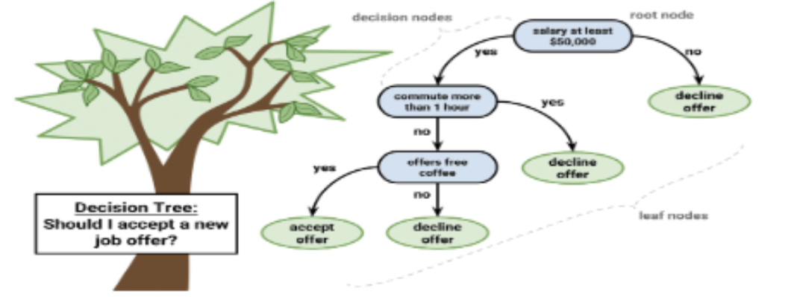
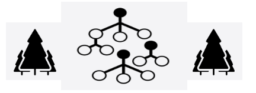
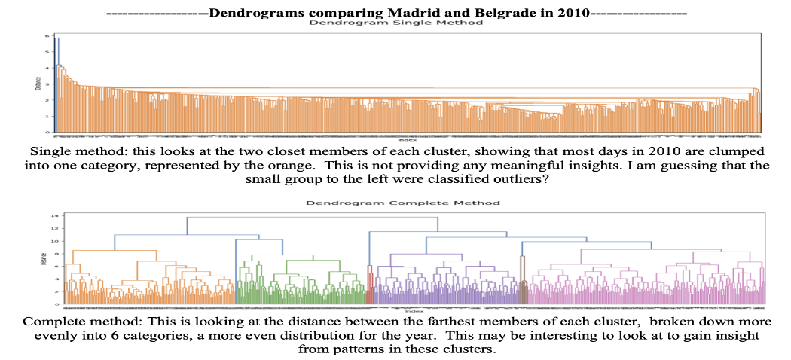

 <a href="/">Home</a> | [Next](project6.md#projec6)

***

# ClimateWins Weather Predictions & Climate Change - Machine Learning
 

## Introduction:
ClimateWins is a fictional European nonprofit organization, that is interested in using machine learning to help predict the consequences of climate change around Europe and, potentially, the world. It’s concerned with extreme weather events, especially in the past 10-20 years. Through use of machine learning, it wants to see if weather conditions can be predicted by looking historically at the temperature highs and lows, and if exploring whether conditions can be predicted to the specification of a given day to prevent weather disasters.

This was an CareerFoundry assignment with the project brief outline included <a href="https://github.com/Nancy-Kolaski/Nancy-Kolaski.github.io/blob/main/assets/Project%20Briefs/Machine-Learning-Achievement-1-Project Brief copy.pdf" target="_blank">here for part 1</a> and <a href="https://github.com/Nancy-Kolaski/Nancy-Kolaski.github.io/blob/main/assets/Project%20Briefs/Machine-Learning-with-Python-Achievement-2-Project Brief copy.pdf" target="_blank">here for part 2</a>.

## Objective:
- Identify weather patterns outside the regional norm in Europe.
- Determine if unusual weather patterns are increasing.
- Generate possibilities for future weather conditions over the next 25 to 50 years based on current trends.
- Determine the safest places for people to live in Europe over the next 25 to 50 years.

## Hypotheses: 
1) ClimateWins can help predict climate change around Europe (and potentially, around the world).
2) The weather from ClimateWins locations are located at the top of a mountain and considered mostly ‘unpleasant’ conditions, and will therefore continue to be unpleasant in the future.
3) The weather climate across Europe will gradually increase over time.
4) Supervised & Unsupervised Learning Algorithms are optimal tools in predictive analysis needed for weather forecasting.

## Data Link: 
The data utilized for this analysis was real world weather data collected between 1800s to 2022 by ‘European Climate Assessment and Data Set Project’, consisting of temperature, wind speed, snow, and global radiation from 18 different weather stations, found at [https://www.ecad.eu/](https://www.ecad.eu/).

## Tools:
- PowerPoint
- Github
- Python (Keras, Tensorflow)
  - pandas, numpy, matplotlib, matplotlib.pyplot, os, operator
  - sklearn: .preprocessing, .metrics, .neural_netwrok, MLPCLassifier, .model_selection, train_test_split, .ensemble, tree import plot_tree, .model_selection 
  - RandomForestClassifier, GridSearchCV,  argmax, metrics
  - multilabel_confusion_matrix, accuracy_score, ConfusionMatrixDisplay, StandardScaler
  - tensorflow, keras (keras.models, keras.layers with LSTM), Sequential, Conv1D, Conv2D, Dense, Dropout, BatchNormalization, Flatten, MaxPooling1D
  - scipy: .cluster.hierarchy import dendrogram, linkage, fcluster
  - bayes_opt, BayesianOptimization, LeakyReLU, BatchNormalization

 

## Machine Learning Algorithms (supervised and unsupervised):
- Gradient Descent Optimization
- K-Nearest Neighbor Algorithm (KNN)
- Artifical Neural Network (ANN)
- Decision Tree
- Convolution Neural Network (CNN)
- Recurrent Neural Network (RNN)
- Hierachical Clustering with Dendrograms
- Random Forests
- Generative Adversarial Network (GANs)
- Pairplots
- K-Means Clustering
- Dendrograms
- Dimensionality Reduction

***

## Insights:
**What is optimization & what did it reveal about temperatures over the past 60 years?**

- **Optimization** lowers the risk of error and improves the accuracy of a model, often used to determine which algorithms to use.  It helps understand valleys and peaks of the local/global landscape of the data.

- **Gradient Descent** (used in both linear and nonlinear data) was used in this study to determine the local minimums and maximums of the data points.
  - A local or gradient descent is one of the simplest ways, and most common ways, to find a local minimum (or valley).  It’s known as a first-order optimization method because it uses the derivative of the function at any point.

Three iterations performed, adjusting step lengths (alpha) in order to get a result as near to 0 as possible.

   

  **We want to know, is climate increasing?**
- Belgrade has freezing minimum temperaturess getting colder over the past 20 years.  It has warmed up by about 5 degrees over the past 60 years, when looking at the mean per year.  The max mean increased 1 degree higher than 60 years ago.
- In general, all means, mins, and max temperatures have increased, with the exception of Valencia (where data is likely skewed due to permanency of 10.7 report).

The chart below shows data over a 60 year span of temperatures in Madrid, Valencia, and Belgrade in the years 1980, 2000, 2018.  

  

Let's take a close look below at Belgrade: 3 iterations performed showing loss of function and loss profile:

 

## Supervised Machine Learning Algorithms:

### KNN (K-Nearest Neighbor) ________________________________________________________________
 

- The KNN classifies data in proximity to it's neighbors.
  - Test Accuracy Scores = 88.46%
  - Accuracy of the results are determined by looking at how close the model’s predictions and estimates match the known classes in the testing set.
  - Review that this algorithm works by comparing distances between nearby data points to determine which group each point belongs to.
  - A typical proportion for comparison purposes would be 75% training set & 25% testing set.

### ANN (Artificial Neural Network)  ________________________________________________________ 

-  The ANN replicates the human brain, consisting of input and output layers, along with the hidden layers by adjusting weights to obtain outcomes.
-  This model tends to have intuitive results.  This model is technically a supervised model, but can act in an unsupervised manner that leads to more complex results.
-  It takes more time to train, and can yield different results for each iteration of the model.
-  The ANN is the basis for modern ML.
   - Train Accuracy Score = 52%
   - Test Accuracy Score = 49%
  

### Decision Tree  __________________________________________________________________________

- Decision Trees model these kinds of questions for many objects at once.  They have roots, branches, and leaves.  The root is the first question asked, with a yes/no answer, leading to another question/branch.  The answer is the leaf/stopping point.
- This model is  good for non-linear data as it easily locates patterns, although it has a tendency to overfit (which is what happened with this project).
- This model had lower accuracy, possibly due to being far too large.  This would have to be pruned down to improve accuracy and show meaningful information.  
  - Train Accuracy Score = 46%
  - Test Accuracy Score = 47%

## Unsupervised Machine Learning Algorithms (Deep Learning):
- **Dimensionality Reduction**: A technque used to interpret large datasets with many dimentions, reduces complexity of a data landscape by redefining aspects oflinearity in the data so tthat it's easier to process patterns.
- **Principal Component Analysis (PCA)**: This technique works buy finding linear represntations in a data set, looking at the greatest variance in the data.
  - pros: events overfitting and can speed up other ML algorithms by making it easier to find patterns 
  - cons: restricted to linear data only, and can loose data as it reduces the landscape dimensions

 
### Random Forest ____________________________________________________________________________

- Randome Forests are collections of Decision Trees.  Each Decision Tree trains on a random sample of the total data, with the final prediction made by averaging predictions by all of the trees.
   - It is an *Ensemble Learning Algorithm* that trains many models at the same time to solve the same problem, producing a more accurate answer and reduces overfitting (since averaging reduces variance bias).
- Identify extreme weather conditions by clustering with dendrograms
  - Compare all stations with Complete method (reduced data) to find trends, then narrow down specific locations to find the extreme weather condition patterns using Single method.
  -Combines multiple decision trees to make the most accurate predictions. Each decision tree trains on a random sample of the total data, with final prediction made by averaging the predictions of all trees.
 - Cons: it is hard to interpret with crowded visualizations, as each tree has a slightly diferent answer.

- **Dendrogram Single Method** (referring to the top dendrogram picture below) can find outliers, interpreted as extreme weather conditions when looking at specific weather stations. It is not as useful when comparing all weather stations
- **Dendrogram Complete Method** (referring to the bottom dendrogram picture below) gives clear, distinct clusters with less noise to find key patterns in the data (all weather stations per year)

### CNN (Convolutional Neural Network) & RNN (Recurrent Neural Network) _________________________

- Determine if unusual weather patterns are increasing:
  - Use CNNs and RNNs to analyze spatial data to find trends across these regions
- CNNs handle images & numerical data as they were inspired by visual cortex processes of the brain. RNNs handle temporal data such as text, handwriting, and speech. - RNNs also use LSTM (long short-term memory), imitating a brain that forgets unimportant data – updating the significant data as needed)

This CNN Model Confusion Matrix below shows 4 weather classes: 0) cloudy 1) rain 2) sunshine 3) sunrise

### GANs(Generative Adversarial Network) ________________________________________________________
  

- GANs can create artificial data (text & images).  This model uses two different neural networks working against eachother.
  - Generator: creates data based on real inputs
  - Discriminator: gets samples of real & artificial data, and then tries to determine which is which.
  - The generator takes the results & attempts to make better artificial data before the whole process is repeated.  In this way, the two adversarial networks work against eachother to improve.

- Determine safest places to live in the future:
  - Use two adversarial neural networks working against each other
     – generator (creates data) & Discriminator (samples of real & artificial, discriminating which is real).
  - Can create artificial data (text & images)
 
- Use Random Forest / Decision Trees (for 2010s) to use predicted weather conditions to determine regional safety. Use the identified features within top locations to gauge future weather predictions.
   - First, narrow down the top locations.
   - Then, look at their top features.

  
 

SO, we are now looking specifically at Madrid, Ljubljana, & Munchenb (top 3 stations from top bar chart) & focusing on the specific features identified from the bottom chart: maximum temperatures, mean temperatures, and global radiation.

I ran through the GAN and got an image result of the weather prediction.  Below is an example of this incorrect weather prediction:
   
  

***

## Major Insights: 
- **Supervised and Unsupervised Machine Learning models can make accurate weather predictions**
   - This study has shown slight temperature increase over time, and has potential to generalize to the rest of the world.
- **KNN (K-Nearest Neighbor) model was the best choice** for unsupervised method (88% accuracy, much higher when compared with the other two).
  - ANN (Artificial Neural Network) has potential to produce a more complete depiction of the data, presuming adjustments are made when eliciting this model as long as there is a good understanding of the model and how to manipulate it for best outcomes.
  - Decision Tree was not useful as the data was too deep and complex for a meaningful insight, nor was RNN useful due to its low accuracy rate and lack of insightful information. These algorithm may run better on sections of data instead of the whole.
- **Random Forest Algorithms are highly accurate and provide useful breakdown of data** to pinpoint weather data features and top locations
  - Dendrograms are useful in finding outliers or extreme weather events (single method) and for finding season trends year round (complete method).
    

## Recommendations:
- **Prune Decision Tree data** to reach a better conclusion and avoid overfitting.
- **Run more iterations on the ANN model** to find more options for training the model to find more optimal variables.
    - Rule out if Sonnblick’s 100% accuracy was due to overfitting or data error.
- Make adjustments within the weather data.
  - **Further clean/check for errors**: as in the case of Valencia showing no variability in min/max/mean temps for the year chosen in this analysis.
  - Incorporate more complete data: **Include more description features to appropriately define ‘pleasant’ vs. ‘unpleasant’ weather conditions**, as interpretations of these classifications are likley to vary across certain regions.
  - **Separate locations into hot/cold regions to eliminate cultural bias**, particularly in perception of what is pleasant vs. unpleasant
    - Someone exposed regularly to freezing temps might interpret a 40 degree day as 'unpleasant' compared to someone else in a tropic region, who might call 40 degree temps 'unpleasant'.
- **Combine supervised and unsupervised algorithms for best results**.
  - **Use Random Forest to narrow down the data features** (either by location or year). Create subsets of data on these important variables. Then, run those through a CNN to produce
higher accuracy. Use final results of these iterations to plug into a GAN to generate more realistic 'artificial' results, for optimal weather predictions.
- **Increase sample size to other parts of the world** besides Europe and run the algorithms again to compare and see if these methods can be used as a generalization for world data.

***

<a href="#top">Back to Top</a> | <a href="/">Home</a> 

