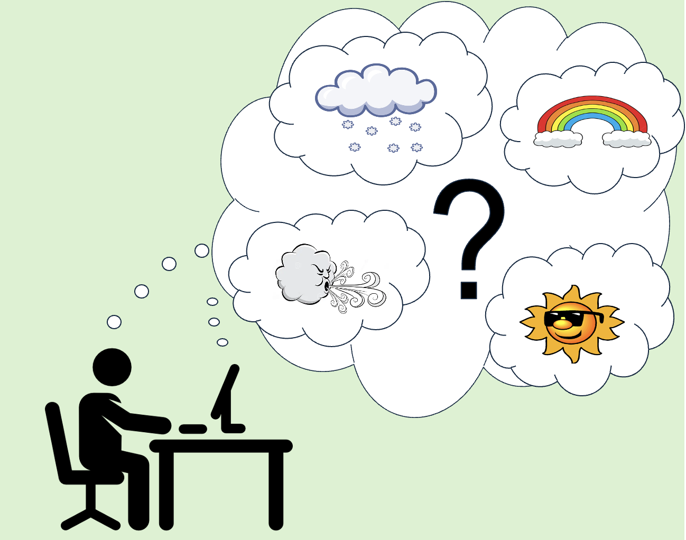

# ClimateWins Weather Predictions & Climate Change - Machine Learning
 

 [Github Respository](https://github.com/Nancy-Kolaski/ML-ClimateWins/tree/main)

## Introduction:
ClimateWins is a fictional European nonprofit organization, that is interested in using machine learning to help predict the consequences of climate change around Europe and, potentially, the world. It’s concerned with extreme weather events, especially in the past 10-20 years. Through use of machine learning, it wants to see if weather conditions can be predicted by looking historically at the temperature highs and lows, and exploring whether conditions can be predicted to a specific given day and can prevent danger.

This was an CareerFoundry assignment with the project breif outline included <a href="https://github.com/Nancy-Kolaski/Nancy-Kolaski.github.io/blob/main/assets/Project%20Briefs/Machine-Learning-Achievement-1-Project Brief copy.pdf" target="_blank">here for part 1</a> and <a href="https://github.com/Nancy-Kolaski/Nancy-Kolaski.github.io/blob/main/assets/Project%20Briefs/Machine-Learning-with-Python-Achievement-2-Project Brief copy.pdf" target="_blank">here for part 2</a>.

## Objective:
- Identify weather patterns outside the regional norm in Europe.
- Determine if unusual weather patterns are increasing.
- Generate possibilities for future weather conditions over the next 25 to 50 years based on current trends.
- Determine the safest places for people to live in Europe over the next 25 to 50 years.

## Hypotheses: 
1) ClimateWins can help predict climate change around Europe (and potentially, around the world).
2) The weather from ClimateWins locations are located at the top of a mountain and considered mostly ‘unpleasant’ conditions, and will therefore continue to be unpleasant in the future.
3) The weather climate across Europe will gradually increase over time.
4) Supervised & Unsupervised Learning algorithms are are optimal tools in predictive analysis needed for weather forecasting.

## Data: 
Data was collected between 1800s to 2022 by ‘European Climate Assessment and Data Set Project’, consisting of temperature, wind speed, snow, and global radiation from 18 different weather stations. found at [https://www.ecad.eu/](https://www.ecad.eu/) 

## Tools
### For this project, the following Python libraries were used:
 - pandas, numpy, matplotlib, matplotlib.pyplot, os, operator
 - sklearn: .preprocessing, .metrics, .neural_netwrok, MLPCLassifier, .model_selection, train_test_split, .ensemble, tree import plot_tree, .model_selection 
 - RandomForestClassifier, GridSearchCV,  argmax, metrics
 - multilabel_confusion_matrix, accuracy_score, ConfusionMatrixDisplay, StandardScaler
 - tensorflow, keras (keras.models, keras.layers with LSTM), Sequential, Conv1D, Conv2D, Dense, Dropout, BatchNormalization, Flatten, MaxPooling1D
 - scipy: .cluster.hierarchy import dendrogram, linkage, fcluster
 - bayes_opt, BayesianOptimization, LeakyReLU, BatchNormalization

 - Python (Keras, Tensorflow)
 - PowerPoint
 - Github

 

## Machine Learning Algorithms:
- Gradient Descent Optimization
- K-Nearest Neighbor Algorithm (KNN)
- Artifical Neural Network (ANN)
- Decision Tree
- Convolution Neural Network (CNN)
- Recurrent Neural Network (RNN)
- Hierachical Clustering with Dendrograms
- Random Forests
- Generative Adversarial Network (GANs)

