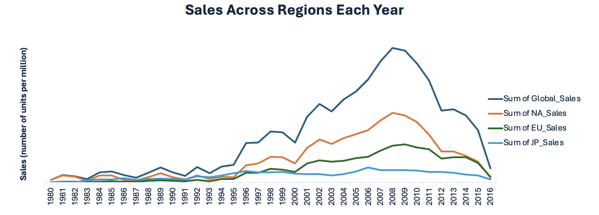
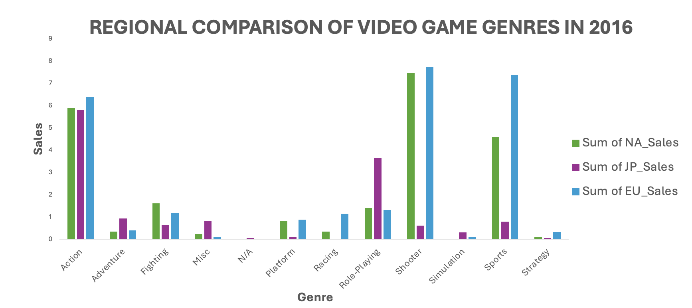
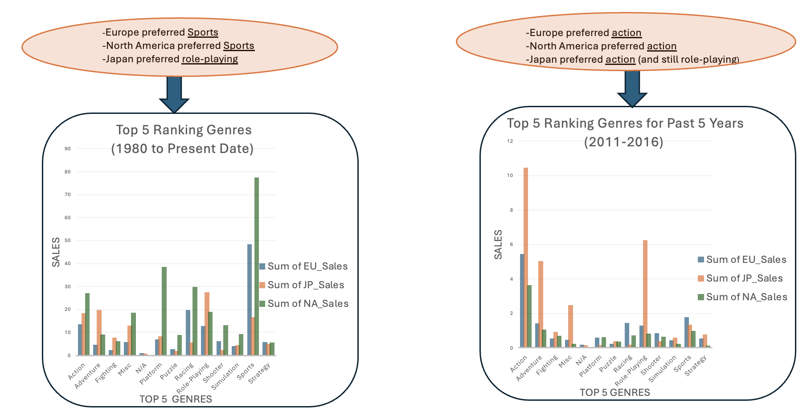
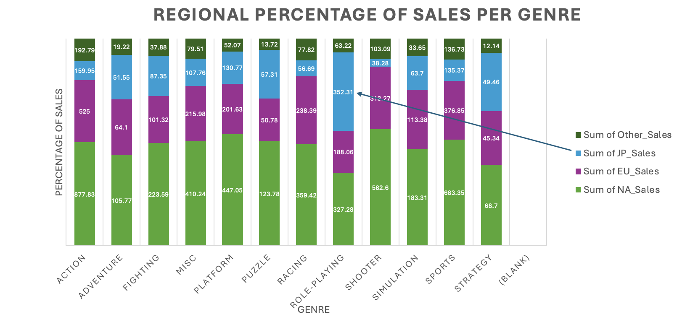
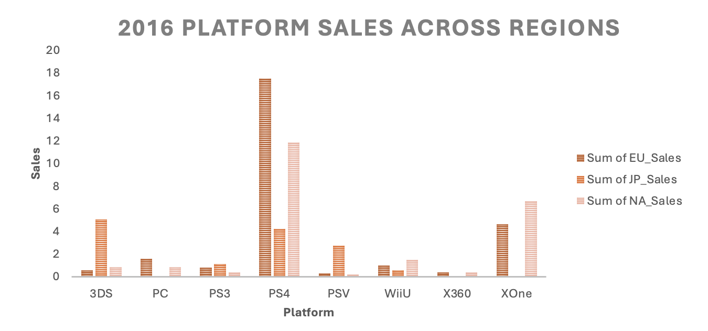
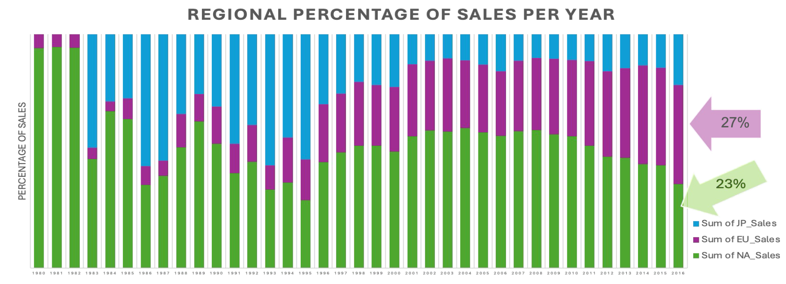

 <a href="/">Back to Main Page</a> 

***

# GameCo Financial Analysis
  

## Introduction:
GameCo is a video game company that wants to develop new games and establish better marketing strategies. Data analysis looked at different variables that impact sales such as genre/types of games, game platforms, publishers, sales across time (historical to 2016), and sales across geographical regions (North America, Europe, & Japan). The current understanding is that video game sales across global regions of Europe, North America, and Japan generally stay the same over time.  GameCo is investigating to make sure their assumption is correct prior to moving forward with further marketing strategies.

This was an CareerFoundry assignment with the project breif outline included <a href="https://github.com/Nancy-Kolaski/Nancy-Kolaski.github.io/blob/main/assets/Project%20Briefs/Video Games Project Breif copy.pdf" target="_blank">here</a>.

## Goal:
Analyze regional and temporal sales trends to make more informed business decisions and develop improved marketing strategies.

## Steps and Skills:
- Data Cleaning
- Descriptive Analysis (mean, mode, median)
- Pivot Tables (Excel)
- Visualizations (line chart, bar chart, stacked bar chart)
- Interpret Results and Summarize findings/insights.

## Tools:
- Excel
- Power Point
  

## Data:
This data set covered historical video games sales (for games that sold more than 10,000 copies) spanning different platforms, games, and publishing studios.  This data was drawn from [vgchartz.com](https://www.vgchartz.com/methodology.php).

*** 

## Insights:
- North America consistently generates the most video game sales in history, even during fluctuations.
  - This line graph demonstrates the positive correlation between North American sales and global sales.
  - Note that there is a steady and sudden decrease in sales after the peak from **2008-2010**.  Global sales dropped from a peak of $679.9 million to $70.93 million in 2016.

  

- In preparation for marketing in 2017, we can look at 2016’s popularity in video game genres.  The chart below supports that action, shooter, and sports games were most popular in North America.  Japan had more popularity with action and role-playing games.
   - Note: Since action games were popular among all three regions including Europe, they should be used as a central part of marketing advertisements across all regions. 

  

- Let’s look at recent shifts in the top-ranking genres for video games across regions:
   - Note: these column charts were generated from the data by filtering by year and ranks

  

- North America has historically dominated sales across regions up until 2016, with a higher percentage rate of sales for all genres except for role-playing.
-  Role-playing games have a higher percentage of sales coming from Japan.  This is interesting to observe as Japan has the lowest percentage rate of all regions, except for this single domain throughout history.
-  Knowing the strong history of role-playing game preference for Japan, it would be wise to target this region with role-playing and action game advertisements (taking into account the data from previous bar charts)

  

- Platform Sales were highest for Nintendo PS4 in 2016!
  - important to note as sales are declining globally the past several years
  
  

## Main Insights:

### What else is happening?
- There has been a recent shift in sales trends.  European sales are on the rise. Look at the percentage of sales distributed for 2016.  Europe is bringing in 27% of sales and North America is bringing in 23% of sales.  **This is the first year in history that Europe has generated more sales than North America**. This is an extremely important insight!

  

### What does this mean?  What insights did we gain? 
- Gameco’s sales for video games are made primarily in North American region, however all sales started dropping from 2010 to 2016.
- Europe has started to bring in more sales percentages than all regions including North America for the first time!  It is likely that this trend can continue.
- Majority of video game sales sold globally are action games.
- In addition to this, North America generates more sales in shooting and sports games
- While Japan generates more sales in role-playing games.
- Nintendo’s PlayStation generated the most sales in 2016 for all regions.

### Gameco now knows if we don't do something different, global sales will continue to nose dive!  

## Recommendations:
- PlayStation Game Marketing
  - Focus marketing strategies moving forward to target the latest release of action-based PlayStation games across all regions. This is important since Nintendo/PS4 is generating the main source of sales globally.
- Marketing for top 3 genres:
  - 1) action -> TOP PICK globally
  - 2) shooter -> in North America & Europe
  - 3) sports -> in North America & Europe
  - 4) role playing -> in Japan only
- Marketing focus in Europe:
  - More marketing in general should be concentrated in Europe as they have brought in more sales than North America for the first time ever in 2016,
and could potentially continue to be a top consumer of GameCo video games in the future.

***

<a href="#top">Back to Top</a>

<a href="/">Back to Main Page</a> 

