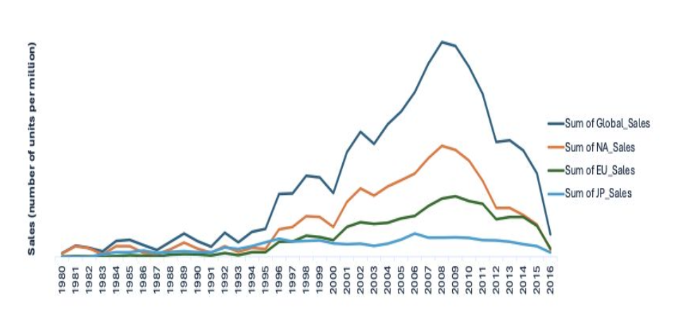

# GameCo Financial Analysis
  

## Introduction:
GameCo is a video game company that wants to develop new games and establish better marketing strategies. Data analysis looked at different variables that impact sales such as genre/types of games, game platforms, publishers, sales across time (historical to 2016), and sales across geographical regions (North America, Europe, & Japan). The current understanding is that video game sales across global regions of Europe, North America, and Japan generally stay the same over time.  GameCo is investigating to make sure their assumption is correct prior to moving forward with further marketing strategies.

This was an CareerFoundry assignment with the project breif outline included <a href="https://github.com/Nancy-Kolaski/Nancy-Kolaski.github.io/blob/main/assets/Project%20Briefs/Video Games Project Breif copy.pdf" target="_blank">here</a>.

## Goal:
Analyze regional and temporal sales trends to make more informed business decisions and develop improved marketing strategies.

## Steps and Skills:
- Data Cleaning
- Descriptive Analysis (mean, mode, median)
- Pivot Tables (Excel)
- Visualizations (line chart, bar chart, stacked bar chart)
- Interpret Results and Summarize findings/insights.

## Tools:
- Excel
- Power Point
  

## Data:
This data set covered historical video games sales (for games that sold more than 10,000 copies) spanning different platforms, games, and publishing studios.  This data was drawn from [vgchartz.com](https://www.vgchartz.com/methodology.php).

*** 

## Insights:
- North America consistently generates the most video game sales in history, even during fluctuations.
  - This line graph demonstrates the positive correlation between North American sales and global sales.
  - Note that there is a steady and sudden decrease in sales after the peak from 2008-2010.  Global sales dropped from a peak of $679.9 million to $70.93 million in 2016.

  

